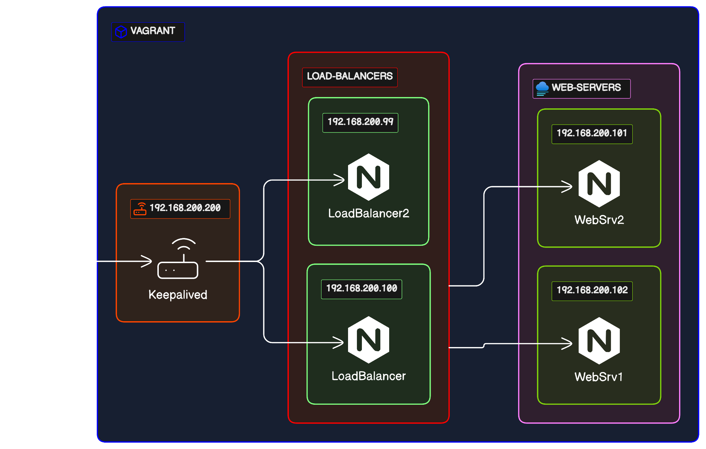

# Vagrant Multi-Node Web Environment

> A Vagrant-based web environment with Load Balancing and High Availability for academic purposes.

---

## Table of Contents

- [Description](#description)
- [Features](#features)
- [Screenshots](#screenshots)
- [Installation](#installation)
- [Usage](#usage)
- [Technologies](#technologies)
---

## Description

This project was developed for an academic course with the aim of creating a ready-to-use environment based on Vagrant with Nginx, Load Balancing, and High Availability.
Vagrantfile creates 4 servers:

* Load Balancer 1 (`192.168.200.100`)
* Load Balancer 2 (`192.168.200.99`)
* Web Server 1 (`192.168.200.101`)
* Web Server 2 (`192.168.200.102`)

and Virtual router (192.168.200.200)

How thats work?
Basically you as a User enter in your's browser `192.168.200.200`
then Virtual Router who every sencond ask about state of Load Balancers point you to one of them (so your're on `192.168.200.100` or `192.168.200.99`)
Then Load Balnacers point you to Web Server where we got our website - and also here we have 2 servers, so based on load on those servers (so you're on `192.168.200.101` or `192.168.200.102`)

---

## Features

- Automatic provisioning of a multi-node web environment
- Load balancing for distributing traffic
- High availability setup using Keepalived
- Self signed SSL certs using mkcert

---

## Installation

To get started with this project, follow these steps:

1. Clone this repository.
2. Install Vagrant and VirtualBox on your machine.
3. Navigate to the project directory in your terminal.
4. Run the command `vagrant up` to start the virtual machines and provision the environment.

---

## Usage

After successfully installing the project, you can access the web environment and test the load balancing and high availability configurations.

---

## Technologies

- Vagrant
- VirtualBox
- Nginx
- Keepalive
- mkcert

---
